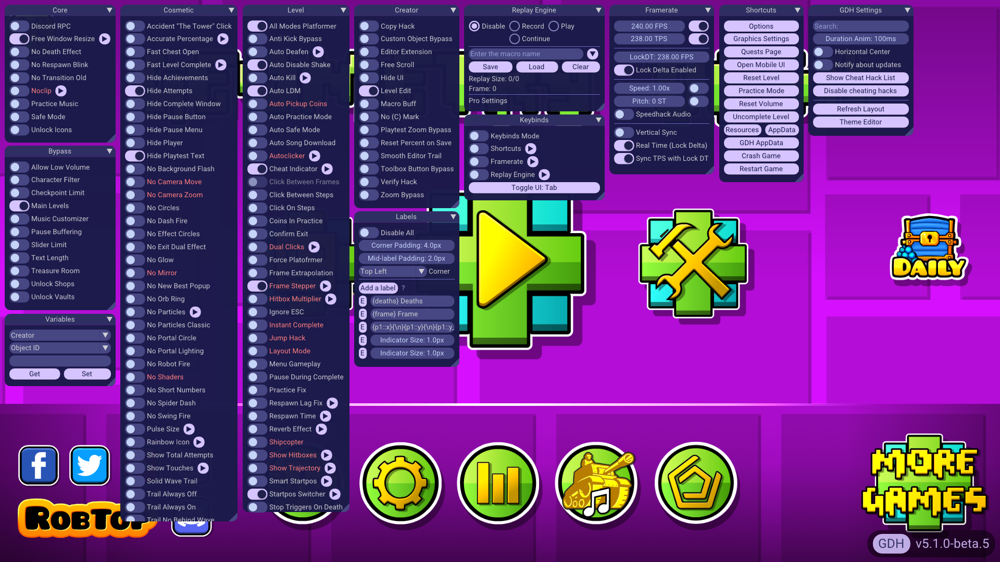
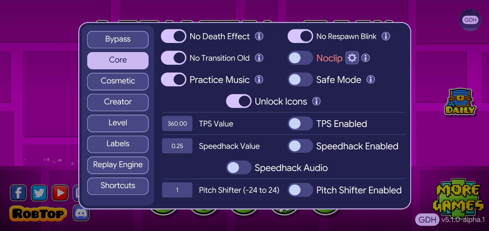

  

# GDH
GDH is a mod menu for Geometry Dash featuring gameplay enhancements and a beautiful interface inspired by Material Design

## Gallery

## Features
- A lot of hacks (100+)
- Beautiful interface inspired by Material Design
- Integrated GD bot (Replay Engine)
- Keybinds
- Startpos Switcher (w/Smart Startpos)
- Frame Extrapolation
- Labels
- Theme Editor
- Recorder
- Variables Editor
- Hitboxes
- Frame Stepper (w/Backward Support)
- Show Trajctory
- Something else coming soon...

## Install GDH directly through the mod catalogue in Geode itself (Recommended)
1. Make sure [Geode](https://geode-sdk.org/) is installed
2. In the mod install menu, under the Discover page, find GDH and install it
3. Restart the game
4. Press <kbd>Tab</kbd> to show the integrated menu
---

Thanks to the aciddev for the logo 
Thank you to everyone who helped grow this project with me